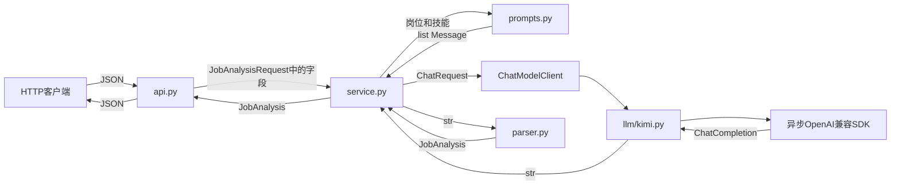

# 架构说明

## 设计目标

岗位分析服务V1把HTTP接口、业务流程、模型供应商和输出解析分开，使各模块可以独立理解、替换和测试。

## 模块职责

| 模块 | 主要职责 | 主要输入 | 主要输出 |
|---|---|---|---|
| `main.py` | 创建FastAPI应用，组装和关闭共享对象 | 环境配置 | FastAPI `app` |
| `api.py` | HTTP路由、依赖获取和异常转换 | `JobAnalysisRequest` | HTTP JSON |
| `api_models.py` | 验证HTTP请求数据 | Python请求数据 | `JobAnalysisRequest` |
| `service.py` | 编排岗位分析工作流 | `str`、`list[str]` | `JobAnalysis` |
| `prompts.py` | 构造岗位分析消息 | 岗位描述、技能列表 | `list[Message]` |
| `parser.py` | 解析并验证模型文本 | `str` | `JobAnalysis` |
| `models.py` | 定义岗位分析结果 | Python字典 | `JobAnalysis` |
| `config.py` | 从环境变量加载Kimi配置 | 环境变量 | `KimiConfig` |
| `exceptions.py` | 统一项目异常类型 | 底层失败 | 项目异常 |
| `llm/models.py` | 定义通用消息和模型请求 | 消息字段 | `Message`、`ChatRequest` |
| `llm/protocols.py` | 定义Service需要的模型接口 | `ChatRequest` | `str` |
| `llm/kimi.py` | 把通用请求适配为Kimi SDK调用 | `ChatRequest` | 模型文本 `str` |

## 请求数据流



## 依赖方向

```text
main.py
├── api.py
├── config.py
├── service.py
└── llm/kimi.py

api.py
├── api_models.py
├── models.py
├── service.py
└── exceptions.py

service.py
├── prompts.py
├── parser.py
├── llm/models.py
└── llm/protocols.py

llm/kimi.py
├── llm/models.py
└── exceptions.py

parser.py
├── models.py
└── exceptions.py
```

Service依赖 `ChatModelClient` 协议，而不是直接依赖 `KimiLLMClient`。生产环境在 `main.py` 中注入Kimi适配器，测试环境可以注入假客户端。

## 对象生命周期

```text
FastAPI启动
→ load_kimi_config()
→ AsyncOpenAI
→ KimiLLMClient
→ JobAnalysisService
→ app.state.job_analysis_service

FastAPI关闭
→ AsyncOpenAI.close()
```

模型SDK客户端和Service在每个应用进程启动时创建一次。每次请求产生的岗位描述、消息、模型文本和分析结果保存在局部变量中。

## 异常边界

```text
JSONDecodeError / ValidationError
→ JobAnalysisParseError
→ HTTP 502

不可用的模型响应
→ LLMResponseError
→ HTTP 502
```

客户端只收到稳定的HTTP错误信息，底层异常通过异常链保留，供服务端排查。
