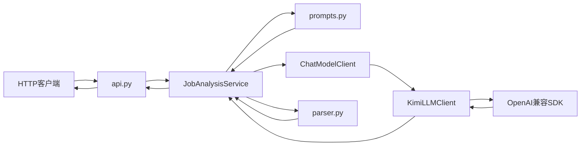
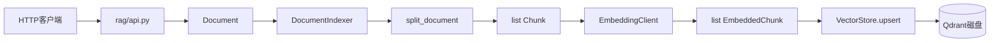

# 架构说明

## 设计目标

Job Analysis Service 包含两个业务能力：

1. 岗位要求与候选人技能匹配分析。
2. 基于持久化知识库的 RAG 问答。

项目将 HTTP 边界、业务流程、模型协议、模型供应商和数据存储分开，使模块可以独立理解、替换和测试。

## 系统边界

```text
HTTP客户端
├── 岗位分析API
│   └── JobAnalysisService
└── RAG API
    ├── DocumentIndexer
    └── RAGAnswerService
        └── Retriever
```

业务服务不直接创建模型客户端或数据库客户端。所有共享对象都在 `main.py` 的 lifespan 中组装。

## 模块职责

### 通用与岗位分析模块

| 模块 | 主要职责 |
|---|---|
| `main.py` | 创建 FastAPI 应用，组装和关闭共享对象 |
| `config.py` | 从环境变量加载 Kimi、Embedding 和 Qdrant 配置 |
| `api.py` | 岗位分析 HTTP 路由和异常转换 |
| `api_models.py` | 验证岗位分析 HTTP 请求 |
| `service.py` | 编排岗位分析业务流程 |
| `prompts.py` | 构造岗位分析提示词 |
| `parser.py` | 将模型文本解析为 `JobAnalysis` |
| `models.py` | 定义岗位分析结果 |
| `exceptions.py` | 定义应用异常 |
| `llm/models.py` | 定义通用消息和模型请求 |
| `llm/protocols.py` | 定义 `ChatModelClient` 协议 |
| `llm/kimi.py` | 将通用请求适配为 Kimi SDK 调用 |

### RAG 模块

| 模块 | 主要职责 |
|---|---|
| `rag/api.py` | RAG HTTP 路由、依赖获取和异常转换 |
| `rag/api_models.py` | 验证 RAG HTTP 请求 |
| `rag/models.py` | 定义 Document、Chunk、EmbeddedChunk、SearchResult 和 RAGAnswer |
| `rag/splitter.py` | 将 Document 切分为 Chunk |
| `rag/embedding.py` | 将 Chunk 批量转换为 EmbeddedChunk |
| `rag/openai_embedding.py` | 调用 OpenAI 兼容 Embedding API |
| `rag/similarity.py` | 计算余弦相似度 |
| `rag/vector_store.py` | 提供内存向量库实现 |
| `rag/qdrant_vector_store.py` | 提供持久化 Qdrant 实现 |
| `rag/context.py` | 将检索结果构造成上下文 |
| `rag/prompts.py` | 构造受约束的 RAG 提示词 |
| `rag/services.py` | 编排索引、检索和回答流程 |
| `rag/protocols.py` | 定义 EmbeddingClient 和 VectorStore 协议 |

## 岗位分析数据流



对应的数据形态：

```text
HTTP JSON
→ JobAnalysisRequest
→ list[Message]
→ ChatRequest
→ 模型文本str
→ JobAnalysis
→ HTTP JSON
```

## RAG 索引数据流



对应的数据形态：

```text
HTTP JSON
→ IndexDocumentRequest
→ Document
→ list[Chunk]
→ list[EmbeddedChunk]
→ Qdrant Point
```

## RAG 问答数据流

```mermaid
flowchart LR
    Client[HTTP客户端] --> API[rag/api.py]
    API --> AnswerService[RAGAnswerService]
    AnswerService --> Retriever[Retriever]
    Retriever --> Embedding[EmbeddingClient]
    Embedding --> Store[VectorStore.search]
    Store --> Qdrant[(Qdrant磁盘)]
    Qdrant --> Results[list SearchResult]
    Results --> Context[build_context]
    Context --> Prompt[build_rag_messages]
    Prompt --> Chat[ChatModelClient]
    Chat --> Answer[RAGAnswer]
    Answer --> API
    API --> Client
```



对应的数据形态：

```text
RAGQuestionRequest
→ question str
→ query vector
→ list[SearchResult]
→ context str
→ list[Message]
→ ChatRequest
→ model text
→ RAGAnswer
→ HTTP JSON
```

## 协议与实现

### ChatModelClient

```text
JobAnalysisService ─┐
                    ├─→ ChatModelClient
RAGAnswerService ───┘
                         └── KimiLLMClient
```

业务服务依赖通用聊天模型协议，不直接依赖 Kimi。

### EmbeddingClient

```text
DocumentIndexer ─┐
                 ├─→ EmbeddingClient
Retriever ───────┘
                      └── OpenAICompatibleEmbeddingClient
```

测试可以注入 `FakeEmbeddingClient`，避免调用真实 API。

### VectorStore

```text
DocumentIndexer ─┐
                 ├─→ VectorStore
Retriever ───────┘
                      ├── InMemoryVectorStore
                      └── QdrantVectorStore
```

生产应用使用 `QdrantVectorStore`，大部分单元和业务集成测试使用 `InMemoryVectorStore`。

## 共享对象关系

`DocumentIndexer` 和 `Retriever` 必须共享同一个向量库：

```text
                  ┌─ DocumentIndexer
QdrantVectorStore ┤
                  └─ Retriever
```

如果两者使用不同实例、不同 Collection 或不同路径，写入的数据将无法被检索。

## Qdrant 数据映射

应用中的一个 `EmbeddedChunk` 对应一个 Qdrant Point：

```text
EmbeddedChunk
├── chunk.chunk_id
├── chunk.document_id
├── chunk.content
├── chunk.chunk_index
├── chunk.metadata
└── vector
```

转换为：

```text
Qdrant Point
├── id
├── vector
└── payload
    ├── chunk_id
    ├── document_id
    ├── content
    ├── chunk_index
    └── metadata
```

Qdrant Point ID 使用 `chunk_id` 生成稳定 UUID。

因此：

```text
相同chunk_id
→ 相同Point ID
→ 再次索引时更新原Point
```

检索时，payload 通过 `Chunk.model_validate()` 恢复为领域模型。

## 向量维度约束

以下三处维度必须一致：

```text
Embedding API输出
= EMBEDDING_DIMENSIONS
= Qdrant Collection vector size
```

当前配置为：

```text
模型：text-embedding-v4
维度：1024
批大小：10
距离：Cosine
```

如果修改 Embedding 维度，应使用新的 Collection，或者删除并重新创建已有 Collection。

## 对象生命周期

### 应用启动

```text
FastAPI lifespan
→ load_kimi_config()
→ load_embedding_config()
→ load_vector_store_config()
→ 创建Kimi AsyncOpenAI客户端
→ 创建Embedding AsyncOpenAI客户端
→ 创建AsyncQdrantClient
→ 创建QdrantVectorStore
→ initialize()检查或创建Collection
→ 创建JobAnalysisService
→ 创建DocumentIndexer
→ 创建Retriever
→ 创建RAGAnswerService
→ 将Service保存到app.state
```

### 请求期间

所有请求共享：

- 模型 SDK 客户端
- Qdrant 客户端
- Service
- Qdrant Collection

每次请求独立创建：

- 请求模型
- Document 和 Chunk
- 查询向量
- SearchResult
- 提示词和回答

### 应用关闭

```text
FastAPI关闭
→ Kimi SDK客户端.close()
→ Embedding SDK客户端.close()
→ Qdrant客户端.close()
```

关闭 Qdrant 客户端会释放本地存储目录的文件锁。

## 配置边界

```text
环境变量
→ config.py
→ KimiConfig
→ EmbeddingConfig
→ VectorStoreConfig
→ main.py组装对象
```

业务服务不读取环境变量，因此可以在测试中直接传入假依赖。

Embedding 维度只从 `EmbeddingConfig` 获取，然后同时传给：

- `OpenAICompatibleEmbeddingClient`
- `QdrantVectorStore`

这样可以减少重复配置导致的不一致。

## 异常边界

岗位分析：

```text
模型响应异常
→ LLMResponseError

JSON或结构验证失败
→ JobAnalysisParseError

API边界
→ HTTP 502
```

RAG：

```text
Embedding调用或响应异常
→ EmbeddingResponseError
→ API边界
→ HTTP 502

LLM响应异常
→ LLMResponseError
→ API边界
→ HTTP 502
```

Qdrant 存储异常目前没有转换为项目级异常，会继续作为未处理的服务端错误。这是后续可以补充的工程化能力。

## 测试结构

| 测试层 | 主要验证内容 |
|---|---|
| 单元测试 | 模型验证、切分、Embedding 流水线、余弦相似度、内存向量库 |
| API 测试 | 请求响应、依赖替换和 HTTP 异常转换 |
| 集成测试 | 岗位分析协作、RAG 索引与问答、Qdrant 持久化 |
| 真实测试 | Kimi 和 DashScope 外部服务 |

Qdrant 持久化测试采用以下流程：

```text
创建第一个客户端
→ 写入数据
→ 关闭客户端
→ 使用相同目录创建第二个客户端
→ 不重新写入
→ 成功检索
```

## 关键架构约束

1. `DocumentIndexer` 和 `Retriever` 必须共享同一向量库。
2. 文档向量和问题向量必须由兼容的 Embedding 模型产生。
3. Qdrant Collection 维度必须与 Embedding 维度一致。
4. RAG 回答只能基于检索上下文，不应执行文档中的指令。
5. 本地 Qdrant 目录只能由一个应用进程打开。
6. API 层负责 HTTP，Service 层负责编排，适配器负责外部服务调用。

## 当前限制

- 尚未提供文档删除和整篇文档更新流程。
- 尚未实现混合检索和 Reranker。
- 尚未建立 RAG 评估数据集。
- 尚未实现用户与知识库隔离。
- 尚未部署独立 Qdrant Server。
- 尚未记录完整链路、耗时、Token 和调用成本。
- 尚未接入 Workflow 和 Agent。
- 